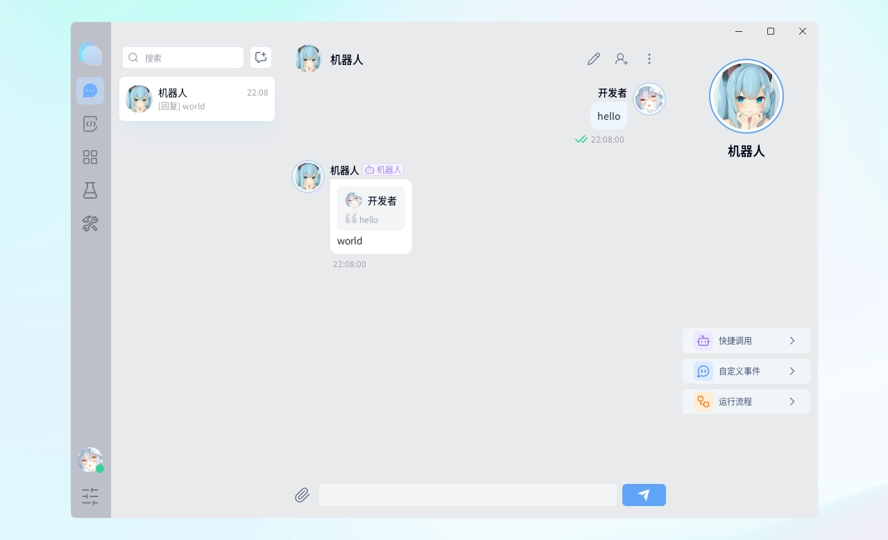
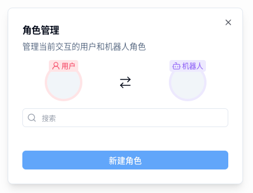
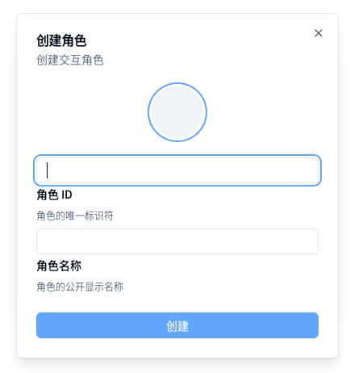
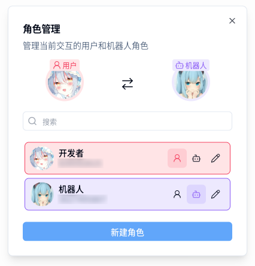
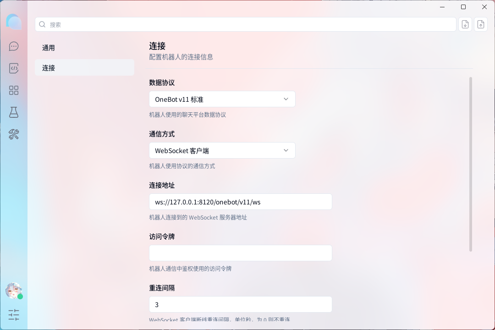

  <a href="https://github.com/A-kirami/matcha">
     
    
     
    <picture>
      <source media="(prefers-color-scheme: dark)" srcset="./public/matcha-text-dark.svg">
      <source media="(prefers-color-scheme: light)" srcset="./public/matcha-text-light.svg">
      
    </picture>
  </a>
   
  模拟聊天交互的辅助开发工具

  
  
   
  
  
  
   
  <a href="#" target="__blank">
    <strong>🌎 演示与预览</strong>
  </a>
  &nbsp;&nbsp;|&nbsp;&nbsp;
  <a href="https://github.com/A-kirami/matcha/releases" target="__blank">
    <strong>📦️ 下载安装包</strong>
  </a>
  &nbsp;&nbsp;|&nbsp;&nbsp;
  <a href="https://jq.qq.com/?_wv=1027&k=SBsy6Rrn" target="__blank">
    <strong>💬 加入交流群</strong>
  </a>

  <a href="https://github.com/A-kirami/matcha" target="__blank">
    <picture>
      <source media="(prefers-color-scheme: dark)" srcset="./docs/preview-dark.webp">
      <source media="(prefers-color-scheme: light)" srcset="./docs/preview-light.webp">
      
    </picture>
  </a>

Matcha is mock chat.

Matcha 是一个专为 [KiramiBot](https://github.com/A-kirami/KiramiBot) 设计的辅助开发工具，能够与 KiramiBot 进行模拟聊天交互，同时提供一系列的开发辅助功能。

它旨在降低开发者的调试与测试的负担，从而更有效率的专注于功能开发。

尽管它主要为 KiramiBot 设计，但只要是符合 Matcha 支持协议的机器人，都可接入并能够使用大部分基础功能。

> [KiramiBot](https://github.com/A-kirami/KiramiBot) 是一个简明轻快的聊天机器人应用，它与 [NoneBot2](https://github.com/nonebot/nonebot2) 完全兼容，同时提供了更多的功能与特性，欢迎体验！

## ✨ 特性

- 小而美，轻巧体积，简约 UI
- 全平台支持（Windows，Mac，Linux）
- 多协议适配支持
- 支持多用户多群组
- 支持多媒体消息（图片、语音、视频）
- 原始事件展示

## 🚀 快速上手

### 创建角色

点击侧边栏底部的圆形按钮，打开角色管理面板。

<picture>
  <source media="(prefers-color-scheme: dark)" srcset="./docs/user-manage-dark.webp">
  <source media="(prefers-color-scheme: light)" srcset="./docs/user-manage-light.webp">
  
</picture>

点击“新建角色”，填写角色信息并创建。

<picture>
  <source media="(prefers-color-scheme: dark)" srcset="./docs/create-user-dark.webp">
  <source media="(prefers-color-scheme: light)" srcset="./docs/create-user-light.webp">
  
</picture>

### 设置用户与机器人

点击角色列表中的按钮，将角色设置为用户和机器人。

<picture>
  <source media="(prefers-color-scheme: dark)" srcset="./docs/bot-user-dark.webp">
  <source media="(prefers-color-scheme: light)" srcset="./docs/bot-user-light.webp">
  
</picture>

### 设置连接

点击侧边栏底部的菜单按钮，打开设置页面，在设置页面中，选择“连接”设置，填写连接信息。

<picture>
  <source media="(prefers-color-scheme: dark)" srcset="./docs/connect-settings-dark.webp">
  <source media="(prefers-color-scheme: light)" srcset="./docs/connect-settings-light.webp">
  
</picture>

提示连接成功后，即可开始使用。

## 🔌 协议适配

- 

  
OneBot v11 标准

  ### 动作

  - [x] 发送私聊消息（send_private_msg）
  - [x] 发送群消息（send_group_msg）
  - [x] 发送消息（send_msg）
  - [x] 撤回消息（delete_msg）
  - [x] 获取消息（get_msg）
  - [ ] 获取合并转发消息（get_forward_msg）
  - [x] 群组踢人（set_group_kick）
  - [x] 群组单人禁言（set_group_ban）
  - [ ] 群组匿名用户禁言（set_group_anonymous_ban）
  - [x] 群组全员禁言（set_group_whole_ban）
  - [x] 群组设置管理员（set_group_admin）
  - [ ] 群组匿名（set_group_anonymous）
  - [x] 设置群名片（set_group_card）
  - [x] 设置群名（set_group_name）
  - [x] 退出群组（set_group_leave）
  - [x] 设置群组专属头衔（set_group_special_title）
  - [x] 处理加好友请求（set_friend_add_request）
  - [x] 处理加群请求／邀请（set_group_add_request）
  - [x] 获取登录号信息（get_login_info）
  - [x] 获取陌生人信息（get_stranger_info）
  - [x] 获取好友列表（get_friend_list）
  - [x] 获取群信息（get_group_info）
  - [x] 获取群列表（get_group_list）
  - [x] 获取群成员信息（get_group_member_info）
  - [x] 获取群成员列表（get_group_member_list）
  - [ ] 获取群荣誉信息（get_group_honor_info）
  - [ ] 获取语音（get_record）
  - [ ] 获取图片（get_image）
  - [x] 检查是否可以发送图片（can_send_image）
  - [x] 检查是否可以发送语音（can_send_record）
  - [x] 获取运行状态（get_status）
  - [x] 获取版本信息（get_version_info）

  ### 事件

  - [x] 私聊消息
  - [x] 群消息
  - [ ] 群文件上传
  - [x] 群管理员变动
  - [x] 群成员减少
  - [x] 群成员增加
  - [x] 群禁言
  - [x] 好友添加
  - [x] 群消息撤回
  - [x] 好友消息撤回
  - [x] 群内戳一戳
  - [ ] 群红包运气王
  - [ ] 群成员荣誉变更
  - [x] 加好友请求
  - [x] 加群请求／邀请
  

- 

  
OneBot v12 标准

  ### 动作

  - [x] 获取支持的动作列表（get_supported_actions）
  - [x] 获取运行状态（get_status）
  - [x] 获取版本信息（get_version）
  - [x] 发送消息（send_message）
  - [x] 撤回消息（delete_message）
  - [x] 获取机器人自身信息（get_self_info）
  - [x] 获取用户信息（get_user_info）
  - [x] 获取好友列表（get_friend_list）
  - [x] 获取群信息（get_group_info）
  - [x] 获取群列表（get_group_list）
  - [x] 获取群成员信息（get_group_member_info）
  - [x] 获取群成员列表（get_group_member_list）
  - [x] 设置群名称（set_group_name）
  - [x] 退出群（leave_group）
  - [x] 上传文件（upload_file）
  - [x] 分片上传文件（upload_file_fragmented）
  - [x] 获取文件（get_file）
  - [x] 分片获取文件（get_file_fragmented）

  ### 事件

  - [x] 私聊消息（message.private）
  - [x] 好友增加（notice.friend_increase）
  - [x] 好友减少（notice.friend_decrease）
  - [x] 私聊消息删除（notice.private_message_delete）
  - [x] 群消息（message.group）
  - [x] 群成员增加（notice.group_member_increase）
  - [x] 群成员减少（notice.group_member_decrease）
  - [x] 群消息删除（notice.group_message_delete）
  

## 📋 路线图

请访问本项目的 [Projects](https://github.com/users/A-kirami/projects/8)

## 🤝 贡献

请参阅[贡献指南](./.github/CONTRIBUTING.md)

### 🍻 鸣谢

感谢以下开发者对本项目的贡献

## 🎊 活动

## 📄 许可证

Code: AGPL-3.0 - 2023 - Akirami

Logo: CC-BY-NC-ND, Designs by Akirami

 

